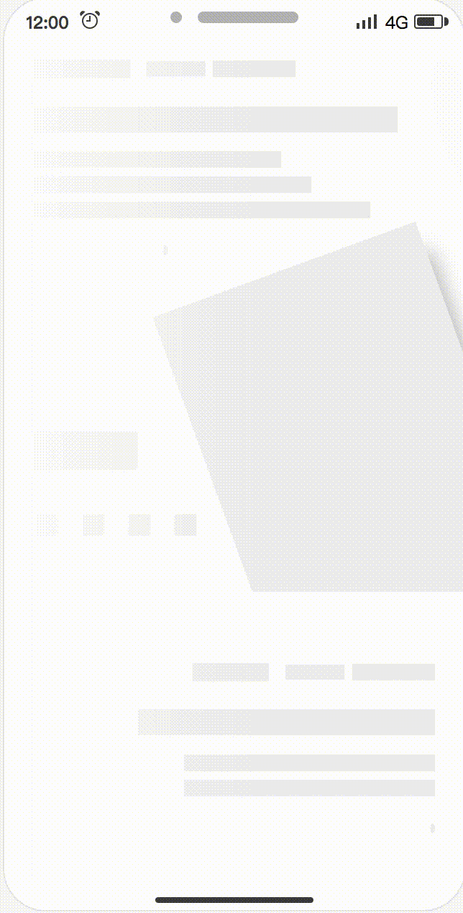
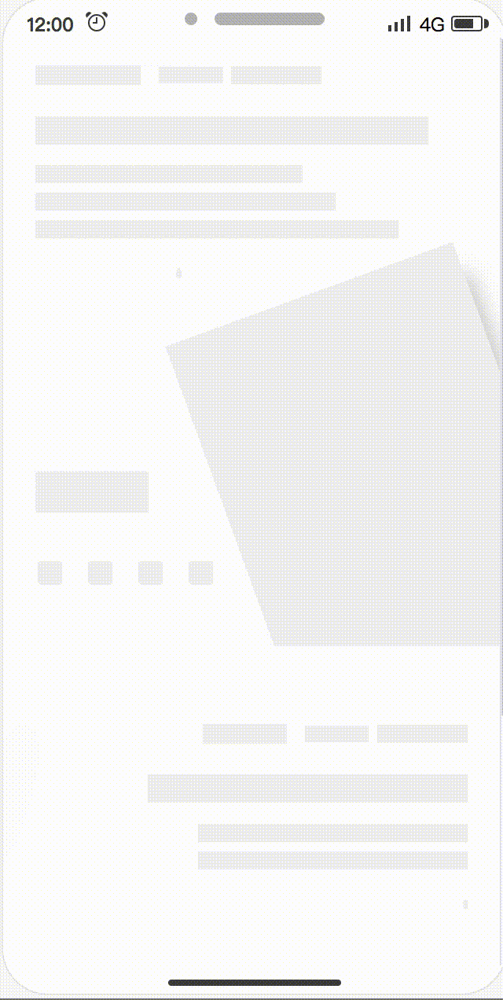

<p align="center">

</p>

<div align="center">
  <strong>:high_brightness:Automatically generate Skeleton Page:crescent_moon:</strong>
</div>

<div align="center">
  A <code>Webpack</code> plugin helps you build better JavaScript application
</div>

<hr />

<div align="center">
  <!-- Version -->
  <a href="https://github.com/ElemeFE/page-skeleton-webpack-plugin">
    
  </a>
  <!-- License -->
  <a href="https://github.com/ElemeFE/page-skeleton-webpack-plugin">
    
  </a>
  <!-- Build Status -->
  <a href="https://github.com/ElemeFE/page-skeleton-webpack-plugin">
    
  </a>
  <!-- Downloads weekly -->
  <a href="https://github.com/ElemeFE/page-skeleton-webpack-plugin">
    
  </a>
</div>

<div align="center">
 <a href="https://nodei.co/npm/page-skeleton-webpack-plugin/"></a>
</div>

<div align="center">

  <h3>
    <a href="https://github.com/ElemeFE/page-skeleton-webpack-plugin/blob/master/docs/i18n/zh_cn.md">
      中文
    </a>
   <span> | </span>
    <a href="https://github.com/ElemeFE/page-skeleton-webpack-plugin#features">
      Features
    </a>
   <span> | </span>
​    <a href="https://github.com/ElemeFE/page-skeleton-webpack-plugin#examples">
      Examples
    </a>
​    <span> | </span>
    <a href="https://github.com/ElemeFE/page-skeleton-webpack-plugin#installation">
      Install
    </a>
    <span> | </span>
    <a href="https://github.com/ElemeFE/page-skeleton-webpack-plugin#basic-use">
      Basic Use
    </a>
    <span> | </span>
    <a href="https://github.com/ElemeFE/page-skeleton-webpack-plugin#documents">
      Documents
    </a>
    <span> | </span>
    <a href="https://github.com/ElemeFE/page-skeleton-webpack-plugin#contribution">
      Contribution
    </a>
  </h3>
</div>

<br />


### Features

Page Skeleton is a webpack plugin. During the development process, use simple click operations to generate the skeleton page corresponding to the development page, and the skeleton page is packaged into your application via webpack so that it can be launched. And you see the skeleton structure of the page before your application starts.

- Support multiple loading animations
- Preview on mobile
- Can be customized, and also directly modify the skeleton page source code in the preview page
- Almost zero configuration available

<h4 align="center">Loading animations</h4>

| Spin | Shine | Chiaroscuro |
|:---:|:---:|:---:|
|  |  |  |

_speed up play_

### Examples

All examples are in the `examples` folder.

* [**sale**](https://github.com/ElemeFE/page-skeleton-webpack-plugin/tree/master/examples/sale)

### Installation

Use `npm` to install this plugin, and you also need to install [html-webpack-plugin](https://github.com/jantimon/html-webpack-plugin).

> npm install --save-dev page-skeleton-webpack-plugin
> 
> npm install --save-dev html-webpack-plugin

### Basic Use

**Step 1：configration**

After installing the plug-in according to the above tutorial, you need to configure the plugin so that the plugin can run normally. The plugin will perform different operations depending on the environment of the node. When `NODE_ENV === 'development'`, the plug-in can perform operations for generating and writing skeleton pages.

```javascript
const HtmlWebpackPlugin = require('html-webpack-plugin')
const { SkeletonPlugin } = require('page-skeleton-webpack-plugin')
const path = require('path')
const webpackConfig = {
  entry: 'index.js',
  output: {
    path: __dirname + '/dist',
    filename: 'index.bundle.js'
  },
  plugin: [
    new HtmlWebpackPlugin({
       // Your HtmlWebpackPlugin config
    }),
    new webpack.DefinePlugin({
      'process.env': {
        NODE_ENV: '"development"' // "development" 是开发，"production"是生产。
      },
    }),
    new SkeletonPlugin({
        pathname: path.resolve(__dirname, `${customPath}`) // 生成名为 shell 文件存放地址
    })
  ]
}
```

:notebook_with_decorative_cover:Since the plugin selects different operations based on the `process.env.NODE_ENV` environment variable, so you need to configurate environment variables in the `scrpt` option in the `package.json` file as follows:

```json
"scripts": {
  "dev": "cross-env NODE_ENV=development node server.js",
  "build": "rm -rf dist && cross-env NODE_ENV=production webpack --progress --hide-modules"
}
```

That is, setting `NODE_ENV` to `development` in the development environment and `NODE_ENV` to `production` in the production environment.

#### Step 2：Modify template `index.html` of html-webpack-plugin

Add comment `<!-- shell -->` in the root element of you application.

```html
<!DOCTYPE html>
<html lang="en">
<head>
  <meta charset="UTF-8">
  <title>Document</title>
</head>
<body>
  <div id="app">
    <!-- shell -->
  </div>
</body>
</html>
```

#### Step 3：Operations and write shell

In the development page, use CtrlOrCmd + enter to call out the plugin interactive interface, or enter the `toggleBar` callout interface in the browser's JavaScript console.


Click the button in the interactive interface to preview the skeleton page. This process may take about 20s. After the plugin is ready for the skeleton page, it will automatically open the preview page through the browser, as shown below.


Scan the QR code in the preview page to preview the skeleton page on the mobile phone. You can directly edit the source code on the preview page. Write the skeleton page into the shell.html file by clicking the Write button in the upper right corner.

Re-package the application with webpack. When the page is restarted, you can see the application's skeleton structure before getting the data.

### Documents

**Server Options**

| Option   | Type            | Required? | Default      | Description                                                  |
| -------- | --------------- | --------- | ------------ | ------------------------------------------------------------ |
| pathname | String          | Yes       | None         | Where the shell.html file shoud be output.                   |
| Port     | String          | No        | 8989         | The port of Page Skeleton server                             |
| debug    | Boolean         | No        | `true`       | Whether debug mode is enabled or not, when debug is true, the output of the headless Chromium console will be output on the terminal. |
| minify   | false or Object | No        | See defaults | The plug-in will uglify the generated shell.html file by default. You can pass [html-minifier](https://github.com/kangax/html-minifier) configuration parameters to mimify shell.html. When configured to false , the generated shell.html file is not uglified and the shell.html file is formatted. |
| logLevel | String          | No        | `info`       | Which type of messages you want to print in terminal, the optional values are `info`, `warn` and default value is `info`. |
| quiet    | Boolean         | No        | `false`      | Whether to print messages on the terminal, when set to true, no messages are printed. |
| noInfo   | Boolean         | No        | `false`      | When the value is `true`, plugin will not print `info` message. |
| logTime  | Boolean         | No        | `true`       | Print formatted time before the message.                     |

**Skeleton Page Options**

| Option    | Type   | Required | Default      | Description                                                  |
| --------- | ------ | -------- | ------------ | ------------------------------------------------------------ |
| loading   | String | No       | spin         | Animations of skeleton page,  enumerated values:`spin` `chiaroscuro` `shine` |
| text      | Object | No       | See defaults | The configuration object can be configured with a color field that determines the color of the text block in the skeleton page. The color value supports hexadecimal, RGB, and so on. |
| image     | Object | No       | See defaults | This configuration accepts 3 properties, color, shape, and shapeOpposite. Color and shape are used to determine the color and shape of the image block in the skeleton page. The color value supports hexadecimal and RGB. The shape supports two enumeration values, `circle` and `rect`. The shapeOpposite field takes an array. Each element in the array is a DOM selector. It is used to select the DOM element. The shape of the selected DOM will be opposite to the configured shape. For example, if the configuration is rect, the image block in the shapeOpposite will be In the skeleton page is displayed as a circle shape (circular), how to configure can refer to the default configuration at the end of this section. |
| button    | Object | No       | See defaults | This configuration accepts two fields, `color` and `excludes`. Color is used to determine the color of the button block in the skeleton page. excludes accepts an array. The elements in the array are DOM selectors used to select elements. The elements in the array will not be considered button blocks. |
| svg       | Object | No       | See defaults | This configuration accepts 3 fields, `color`, `shape`, and `shapeOpposite`. Color and shape are used to determine the color and shape of the svg block in the skeleton page. The color value supports hexadecimal and RGB, and also supports the `transparent` enumeration value. After setting to transparent, the svg block will be a transparent block. Shapes support two enumeration values, `circle` and `rect`. The shapeOpposite field accepts an array. Each element in the array is a DOM selector for selecting the DOM element. The shape of the selected DOM will be the opposite of the configured shape shape. For example, if the configuration is rect then the svg block in the shapeOpposite will be In the skeleton page is displayed as a circle shape (circular). |
| pseudo    | Object | No       | See defaults | This configuration accepts two fields, `color` and `shape`. Color is used to determine the color of the skeletal page that is treated as a pseudo-element block, and shape is used to set the shape of the pseudo-element block, accepting two enum values: `circle` and `rect`. |
| excludes  | Array  | No       | `[]`         | If you have an element that does not require skeleton processing, write the element's CSS selector in the array. |
| remove    | Array  | No       | `[]`         | If you have elements that need to be removed from the DOM are configured with a CSS selector that will be removed in DOM tree. |
| hide      | Array  | No       | `[]`         | Don't want to remove it, but hide the element by setting its transparency to 0 and config element's CSS selector in the array. |
| grayBlock | Array  | No       | `[]`         | The elements in the array are CSS selectors. The selected element will be processed by the plug-in into a color block. The color of the color block is the same as the color of the button block. Internal elements will no longer be specially treated and text will be hidden. |
| cssUnit   | String | No       | `rem`        | The enum values it accepts are `rem`, `vw`, `vh`, `vmin`, `vmax`. |
| decimal   | Number | No       | 4            | Config the decimal of the css value in the skeleton page (shell.html). The default value is 4. |

**Puppeteer Options**

| Options | Type   | Required? | Default         | Description                                                  |
| ------- | ------ | --------- | --------------- | ------------------------------------------------------------ |
| device  | String | No        | `iPhone 6 Plus` | Used to set which mobile device simulator to generate the skeleton page. Refer to [puppeteer](https://github.com/GoogleChrome/puppeteer/blob/master/DeviceDescriptors.js) for configuration. |
| defer   | Number | No        | 5000            | Puppeteer starts the headless Chrome browser. The delay after opening the page is mainly to ensure that the page is fully loaded and the unit is `ms`. |
| cookie  | Array  | No        | `[]`            | Refer to [puppeteer](https://github.com/GoogleChrome/puppeteer/blob/master/DeviceDescriptors.js). |

**Default options**

```javascript
const pluginDefaultConfig = {
  port: '8989',
  text: {
    color: '#EEEEEE'
  },
  image: {
    shape: 'rect', // `rect` | `circle`
    color: '#EFEFEF',
    shapeOpposite: []
  },
  button: {
    color: '#EFEFEF',
    excludes: [] 
  },
  svg: {
    color: '#EFEFEF',
    shape: 'circle', // circle | rect
    shapeOpposite: []
  },
  pseudo: {
    color: '#EFEFEF', // or transparent
    shape: 'circle' // circle | rect
  },
  device: 'iPhone 6 Plus',
  debug: false,
  minify: {
    minifyCSS: { level: 2 },
    removeComments: true,
    removeAttributeQuotes: true,
    removeEmptyAttributes: false
  },
  defer: 5000,
  excludes: [],
  remove: [],
  hide: [],
  grayBlock: [],
  cookies: [],
  cssUnit: 'rem',
  decimal: 4,
  logLevel: 'info',
  quiet: false,
  noInfo: false,
  logTime: true
}
```

### Contribution

The project is under active development. If you have any questions, please submit your issues. Please refer to the issue template to submit the issue. If you are fixing a bug in the issues, please discuss it in the issue before submit the PR. If it is a new feature, submit a feature-related issue first before submit the PR.

There are three main development folders in the project:

- client: Used to communicate between development projects and plugin server.
- preview: The code of the preview page.
- src: plugin server code.
     - script: script to generate the skeleton page.

Special thanks to @Yasujizr who designed the banner of Page Skeleton.

**Maintainer**

[](https://github.com/Jocs)

### License

 [**MIT**](https://github.com/ElemeFE/page-skeleton-webpack-plugin/blob/master/LICENSE).

Copyright (c) 2017-present, @ElemeFE
